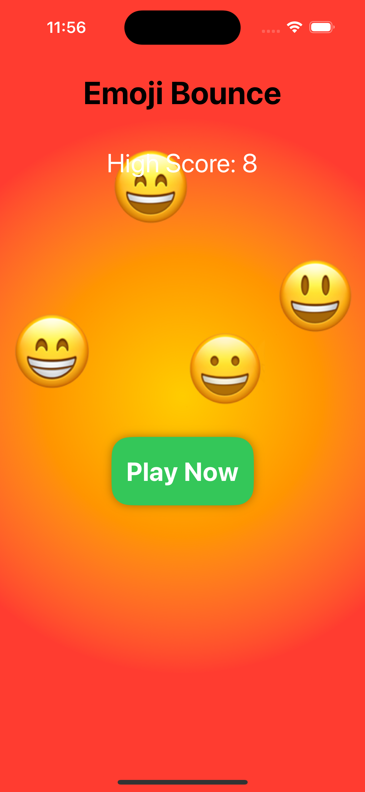
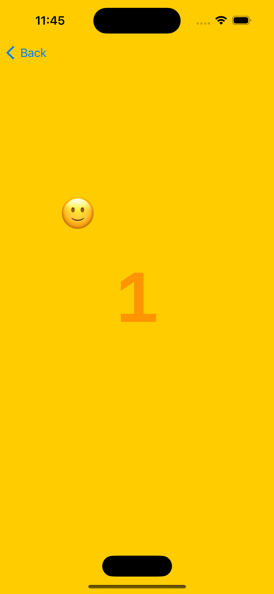

# Emoji Bounce Game


## Description

Emoji Bounce is a simple game built using SwiftUI where the player controls a smiley emoji bouncing around the screen. The goal is to prevent the emoji from falling off the screen by bouncing it off a paddle controlled by the player.

## Features

- Bouncing emoji animation.
- Player-controlled paddle to prevent the emoji from falling off.
- Score tracking.
- Game over alert when the emoji falls off the screen.

## Screenshots




## How to Play

1. Clone the repository to your local machine.

```bash
-git clone https://github.com/omkar-107/bounce.git
```
2. pen the project in Xcode.
3. Build and run the project on a simulator or a physical device.
4. Drag the paddle left or right to bounce the emoji and prevent it from falling off the screen.
5. Score points by bouncing the emoji off the paddle. The game ends when the emoji falls off the screen.
